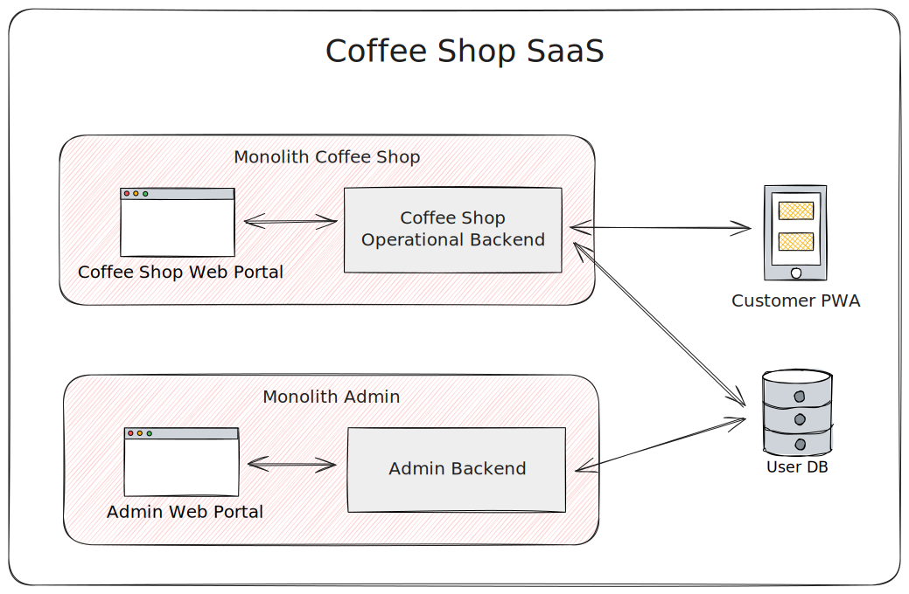

# Project Summary: Digitalizing Coffee Shop Operations with a Unified Platform

## A. Current Situation and Opportunity
A coffee shop owner with extensive industry experience seeks to modernize operations through digital solutions. The current manual system leads to inefficiencies in order processing, inventory management, and overall customer service.

## B. Proposed Solution
Develop a comprehensive SaaS-based platform comprising a unified application for internal operations and a customer-facing PWA, complemented by an admin portal for the SaaS provider.

## C. System Descriptions and Requirements

### C.1. Customer PWA
**Description:** A Progressive Web App that allows customers to view menus, place orders, and track order status via their mobile devices.

**Functional Requirements:**
- Access to the digital menu with item details and prices.
- Secure order placement linked by table-specific QR/barcodes.
- Order status updates in real-time.

**Non-Functional Requirements:**
- Responsive and user-friendly interface.
- Fast load times and secure data handling.
- Compatibility across various devices and browsers.

### C.2. Coffee Shop Portal
**Description:** A single application supporting cashier, inventory manager, and shop owner roles through role-based access control.

**Functional Requirements:**
- **Cashier Functions**: Real-time order management, payment processing, and receipt issuance.
- **Inventory Manager Functions**: Inventory monitoring, menu updates, and reporting.
- **Shop Owner Functions**: User role management, shop configuration, and analytics access.

**Non-Functional Requirements:**
- Modular design for potential future separation.
- Robust security and scalability.
- High availability and performance.

### C.3. Admin Portal (SaaS Owner)
**Description:** A portal to manage tenant accounts, subscriptions, and overall system performance.

**Functional Requirements:**
- User and subscription management tools.
- Billing and invoicing, payment processing.
- System monitoring, analytics, and client support tools.

**Non-Functional Requirements:**
- Robust security and access controls.
- Efficient scalability to handle growth.
- High reliability and real-time insights.

## D. Suggested Approach for Development

1. **Modular and Scalable Design**:
   - Focus on a modular architecture to simplify potential decoupling of unified systems as needs evolve.
   
2. **Role-Based Access Control**:
   - Implement flexible RBAC within the unified application for distinct access control across user roles.

3. **Deployment and Monitoring Infrastructure**:
   - Utilize cloud services for scalability and availability, with monitoring tools for performance insights.

4. **Iterative Development in Phases**:
   - Employ Agile methodologies to ensure nimble development, adjustments, and enhancements based on user feedback.

5. **Training and Support**:
   - Develop comprehensive training materials and support options to facilitate user adoption across all systems.

By addressing both customer-facing and administrative needs, the proposed solution provides a cohesive, scalable, and efficient path to digital transformation for coffee shop operations across multiple tenants.
